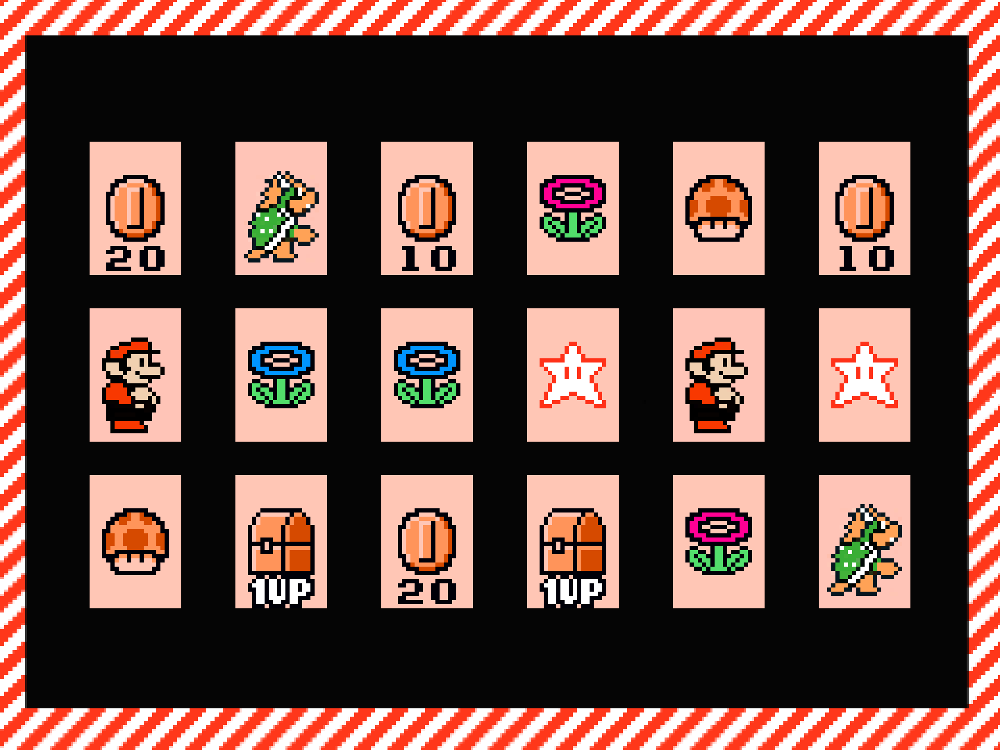

Marioflip-scratch
=================

Super Mario Bros 3's cardflip minigame written in [Scratch](http://scratch.mit.edu/).

Try [this project on scratch forum](http://scratch.mit.edu/projects/xenosoz/2727145).

Credits
-------
* [Scratch](http://scratch.mit.edu/) is a visual programming language by
  [MIT Media Lab](http://www.media.mit.edu/).
* Image resources are from
[Super Mario Bros. 3](http://en.wikipedia.org/wiki/Super_Mario_Bros._3), a
famous video game developed/published by
[Nintendo](http://www.nintendo.com/).
